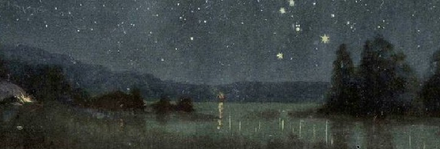

<p align="center">
  
</p>

```rust
impl Myself {
    fn build() -> Self {
        Self {
            name: "waris",
            ide: "Visual Studio Code",
            os: "Arch Linux",
            age: 16,
            location: "India",
            languages: vec![
                "Rust", "C", "C++", "Golang", 
                "Python", "Elixir", "etc."
            ],
            interests: vec![
                "Systems", "Animation", "Aerospace", "Low-level stuff
            ],
            discord: "itzwaris",
        }
    }
}
```
